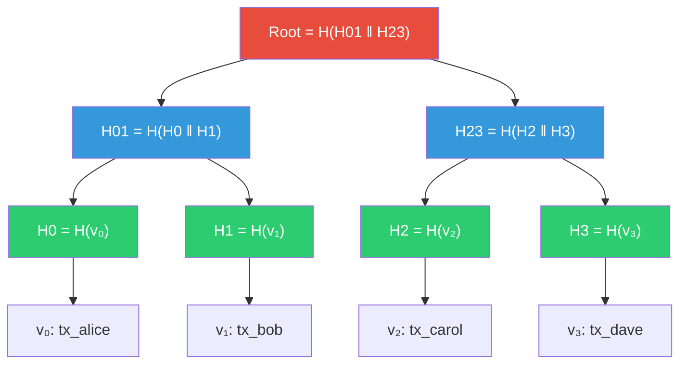
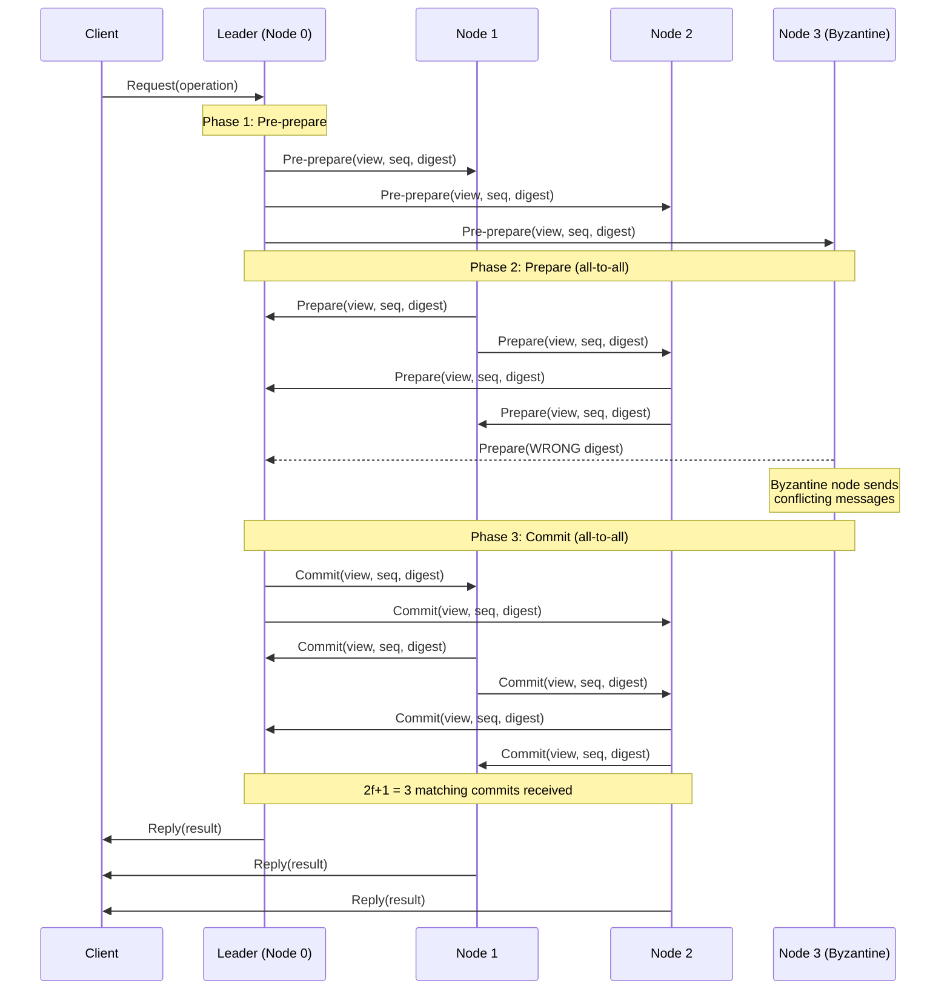
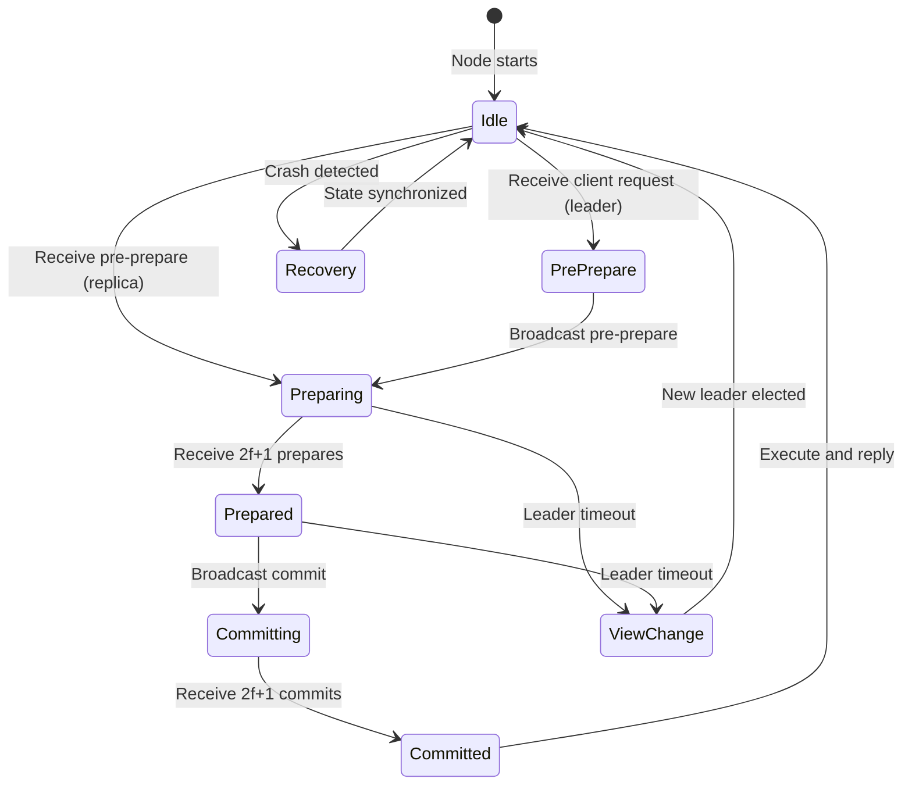

# Merkle Consensus

A from-scratch implementation of hash chains, Merkle trees with inclusion/exclusion proofs, and a simplified Byzantine Fault Tolerant (BFT) consensus protocol. Demonstrates how cryptographic data structures and distributed agreement algorithms work together to build tamper-evident, trustless systems — the foundation of blockchains, audit logs, and distributed databases.

## Theory & Background

### Why Tamper-Evidence and Consensus Matter

Imagine a shared spreadsheet where anyone can edit any cell, and you need to know if someone changed a past entry. In a centralized system, you trust the server. In a distributed system with no central authority, you need two things: a data structure that makes tampering detectable (Merkle trees), and a protocol that lets nodes agree on the current state even when some nodes lie (BFT consensus). Together, these primitives enable trustless collaboration — participants don't need to trust each other, only the math.

### Hash Chains: The Simplest Tamper-Evident Structure

A hash chain links records together by including the hash of the previous record in each new one. If anyone modifies a past record, every subsequent hash changes, making the tampering immediately detectable.

Given a hash function $H$ and a sequence of data blocks $d_0, d_1, \ldots, d_n$, the chain is:

```math
h_0 = H(d_0), \quad h_i = H(h_{i-1} \| d_i) \quad \text{for } i = 1, \ldots, n
```

where $\|$ denotes concatenation. The final hash $h_n$ is the **chain head** — a single value that commits to the entire history. Changing any $d_i$ invalidates $h_i$ and every hash after it.

This is exactly how Git commits work: each commit includes the hash of its parent, creating an immutable history. Blockchains extend this by adding consensus on which chain is canonical.

### Merkle Trees: Efficient Verification at Scale

Hash chains require $O(n)$ verification — you must rehash the entire chain to check one element. Merkle trees solve this by organizing hashes into a binary tree, enabling $O(\log n)$ inclusion proofs.

A Merkle tree over $n$ leaf values $v_0, \ldots, v_{n-1}$ is built bottom-up:

```math
\text{leaf}_i = H(v_i), \quad \text{node}_{i,j} = H(\text{child}_{\text{left}} \| \text{child}_{\text{right}})
```

The **Merkle root** is the single hash at the top of the tree. It commits to all $n$ values — changing any leaf changes the root.

**Inclusion proof**: To prove that $v_k$ is in the tree, you provide the $O(\log n)$ sibling hashes along the path from $v_k$'s leaf to the root. The verifier recomputes the root from the leaf and siblings, and checks it matches the known root.

The proof size is $\lceil \log_2 n \rceil$ hashes. For a tree with 1 million leaves, the proof is only 20 hashes — roughly 640 bytes with SHA-256.

**Proof verification** for a leaf at index $k$ with sibling hashes $s_0, s_1, \ldots, s_{d-1}$ (where $d = \lceil \log_2 n \rceil$):

```math
h_0 = H(v_k), \quad h_{i+1} = \begin{cases} H(h_i \| s_i) & \text{if } k_i = 0 \\ H(s_i \| h_i) & \text{if } k_i = 1 \end{cases}
```

where $k_i$ is the $i$-th bit of $k$ (determining whether the node is a left or right child). The proof is valid if $h_d$ equals the known Merkle root.

### Merkle Tree Construction



To prove $v_1$ is in the tree, the prover provides sibling hashes $\{H_0, H_{23}\}$. The verifier computes $H(H(H_0 \| H(v_1)) \| H_{23})$ and checks it matches the root.

### Byzantine Fault Tolerance: Agreement Despite Liars

In a distributed system with $n$ nodes, some may be **Byzantine** — they can crash, send conflicting messages, or actively try to subvert the protocol. The Byzantine Generals Problem (Lamport, 1982) asks: how many honest nodes do you need to reach agreement?

The answer is $n \geq 3f + 1$, where $f$ is the maximum number of Byzantine nodes. With fewer honest nodes, Byzantine nodes can create a split-brain scenario where different honest nodes commit different values.

**Why $3f + 1$?** Consider a system with $n$ nodes and $f$ Byzantine faults. For safety, a quorum (the set of nodes needed to make a decision) must overlap with any other quorum by at least $f + 1$ nodes — ensuring at least one honest node is in every pair of quorums. This requires:

```math
2q - n \geq f + 1 \quad \Rightarrow \quad q \geq \frac{n + f + 1}{2}
```

For this quorum size to be achievable (i.e., $q \leq n$), we need $n \geq 3f + 1$.

### PBFT: Practical Byzantine Fault Tolerance

PBFT (Castro & Liskov, 1999) is a three-phase protocol that achieves consensus in $O(n^2)$ message complexity:

1. **Pre-prepare**: The leader proposes a value and broadcasts it
2. **Prepare**: Each node broadcasts a prepare message; a node is "prepared" when it receives $2f + 1$ matching prepares (including its own)
3. **Commit**: Each prepared node broadcasts a commit message; a node commits when it receives $2f + 1$ matching commits

The protocol guarantees:
- **Safety**: No two honest nodes commit different values (as long as $f \leq \lfloor (n-1)/3 \rfloor$)
- **Liveness**: The system eventually makes progress (requires view changes when the leader is faulty)

The total message complexity per consensus round is:

```math
\text{Messages} = O(n) + O(n^2) + O(n^2) = O(n^2)
```

The $O(n^2)$ cost comes from the all-to-all broadcast in the prepare and commit phases. This limits PBFT to networks of roughly 20-100 nodes. Modern protocols like HotStuff reduce this to $O(n)$ using threshold signatures.

### PBFT Consensus Protocol Flow



### Consensus Node Lifecycle



### Block Finalization Timeline

```mermaid
gantt
    title PBFT Block Finalization Pipeline
    dateFormat X
    axisFormat %s

    section Block N
        Client request received       :0, 1
        Pre-prepare (leader)           :1, 2
        Prepare phase (all-to-all)     :2, 4
        Commit phase (all-to-all)      :4, 6
        Execute and reply              :6, 7

    section Block N+1
        Client request received        :3, 4
        Pre-prepare (leader)           :7, 8
        Prepare phase (all-to-all)     :8, 10
        Commit phase (all-to-all)      :10, 12
        Execute and reply              :12, 13

    section Merkle State
        Build Merkle tree (Block N)    :6, 7
        Build Merkle tree (Block N+1)  :12, 13
        State proof generation         :13, 14
```



### Tradeoffs and Alternatives

| Aspect | This Implementation | Alternative | Tradeoff |
|--------|-------------------|-------------|----------|
| **Consensus** | PBFT ($O(n^2)$ messages) | HotStuff ($O(n)$ messages) | PBFT is simpler to implement and reason about; HotStuff scales to thousands of nodes but requires threshold signatures |
| **Hash function** | SHA-256 | BLAKE3, Keccak | SHA-256 is ubiquitous and hardware-accelerated; BLAKE3 is faster in software; Keccak (SHA-3) offers structural diversity |
| **Tree structure** | Binary Merkle tree | Merkle Patricia Trie | Binary trees are simpler with $O(\log n)$ proofs; Patricia tries support efficient key-value lookups (used in Ethereum) |
| **Fault model** | Byzantine ($3f + 1$) | Crash-only ($2f + 1$) | Byzantine tolerance handles malicious nodes but requires more replicas; crash-only (Raft, Paxos) is simpler when nodes are trusted |
| **Finality** | Immediate (BFT) | Probabilistic (Nakamoto) | BFT gives instant finality but limits network size; Nakamoto consensus scales to thousands of nodes but blocks can be reverted |

### Key References

- Merkle, "A Digital Signature Based on a Conventional Encryption Function" (1987) — [Springer](https://doi.org/10.1007/3-540-48184-2_32)
- Lamport, Shostak & Pease, "The Byzantine Generals Problem" (1982) — [ACM](https://doi.org/10.1145/357172.357176)
- Castro & Liskov, "Practical Byzantine Fault Tolerance" (1999) — [OSDI](https://pmg.csail.mit.edu/papers/osdi99.pdf)
- Yin et al., "HotStuff: BFT Consensus with Linearity and Responsiveness" (2019) — [arXiv](https://arxiv.org/abs/1803.05069)
- Laurie, "Certificate Transparency" RFC 6962 (2013) — [IETF](https://datatracker.ietf.org/doc/html/rfc6962)

## Real-World Applications

Merkle trees and consensus protocols are the backbone of systems that need tamper-evidence and distributed agreement without a central authority. They show up wherever multiple parties must share a single source of truth — from financial ledgers to software supply chains.

| Industry | Use Case | Impact |
|----------|----------|--------|
| **Blockchain / DeFi** | Transaction ordering and state commitment using Merkle roots in block headers, with BFT consensus for validator agreement | Enables trustless financial systems processing billions in daily volume without intermediaries |
| **Supply chain** | Provenance tracking where each handoff is a hash-chained record with Merkle proofs for selective disclosure to auditors | Reduces counterfeit goods and compliance violations by making supply chain history tamper-evident |
| **Audit logging** | Append-only hash-chained logs where each entry commits to all previous entries, with Merkle proofs for efficient audits | Meets regulatory requirements (SOX, HIPAA) by guaranteeing log integrity — any tampering is cryptographically detectable |
| **Distributed databases** | Anti-entropy protocols using Merkle trees to efficiently detect and synchronize divergent replicas (e.g., Amazon Dynamo, Apache Cassandra) | Reduces synchronization bandwidth by orders of magnitude — only differing subtrees need to be exchanged |
| **Certificate transparency** | Public append-only logs of TLS certificates with Merkle inclusion proofs, enabling browsers to detect misissued certificates | Protects billions of web users by making it impossible for a certificate authority to secretly issue fraudulent certificates |

## Project Structure

```
merkle-consensus/
├── src/
│   ├── __init__.py
│   ├── hashing/
│   │   ├── __init__.py
│   │   ├── hash_chain.py          # Hash chain construction and verification
│   │   ├── commitments.py         # Hash-based commitment schemes
│   │   └── utils.py               # Hashing utilities and serialization
│   ├── merkle/
│   │   ├── __init__.py
│   │   ├── tree.py                # Merkle tree construction (binary)
│   │   ├── proof.py               # Inclusion proof generation and verification
│   │   └── sparse.py              # Sparse Merkle tree for key-value commitments
│   ├── consensus/
│   │   ├── __init__.py
│   │   ├── pbft.py                # PBFT protocol (pre-prepare, prepare, commit)
│   │   ├── view_change.py         # View change protocol for leader failure
│   │   ├── log.py                 # Consensus message log and quorum tracking
│   │   └── block.py               # Block structure with Merkle state root
│   └── network/
│       ├── __init__.py
│       ├── simulator.py           # Network simulator with configurable latency
│       ├── node.py                # Consensus node with message handling
│       └── faults.py              # Byzantine fault injection (drop, delay, corrupt)
├── requirements.txt
├── .gitignore
└── README.md
```

## Quick Start

```bash
pip install -r requirements.txt

# Build a Merkle tree and generate an inclusion proof
python -m src.merkle.tree --leaves "alice:100,bob:50,carol:75,dave:200"

# Verify a Merkle inclusion proof
python -m src.merkle.proof --leaf "bob:50" --root <root_hash> --proof <proof_hashes>

# Run a 4-node PBFT consensus simulation
python -m src.consensus.pbft --nodes 4 --byzantine 1 --rounds 10

# Simulate network with fault injection
python -m src.network.simulator --nodes 7 --faults 2 --scenario partition
```

## Implementation Details

### What makes this non-trivial

- **Sparse Merkle trees**: A standard Merkle tree requires all leaves to be present. The sparse variant uses a default hash for empty leaves, enabling efficient proofs of non-inclusion — proving that a key is NOT in the tree. This requires careful handling of the $2^{256}$-leaf virtual tree without materializing it.
- **View change correctness**: When the PBFT leader is faulty, replicas must elect a new leader and transfer state without losing committed operations. The view change protocol collects $2f + 1$ view-change messages, each containing the node's prepared certificates, and the new leader constructs a new-view message that proves it has the latest committed state.
- **Quorum intersection guarantee**: The implementation enforces that any two quorums of size $2f + 1$ overlap by at least $f + 1$ nodes. This is verified at runtime — if the network partition prevents forming a quorum, the protocol safely halts rather than risking a split-brain commit.
- **Byzantine fault injection**: The network simulator supports configurable fault models — message dropping, reordering, duplication, and content corruption — allowing systematic testing of the consensus protocol under adversarial conditions. Faults are injected probabilistically or deterministically based on scenario configuration.
- **Hash chain checkpointing**: For long-running chains, the implementation supports periodic checkpoints where the chain state is summarized into a Merkle root, enabling efficient verification of recent entries without replaying the entire history.
